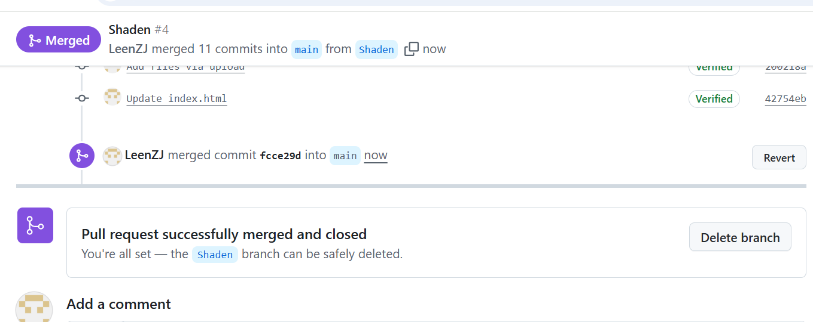
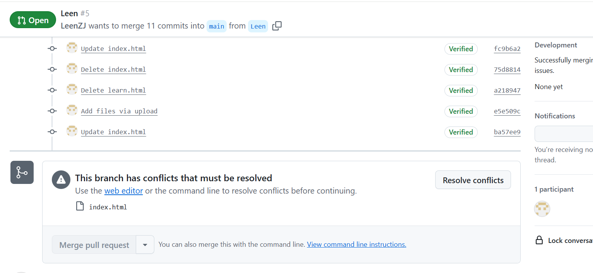
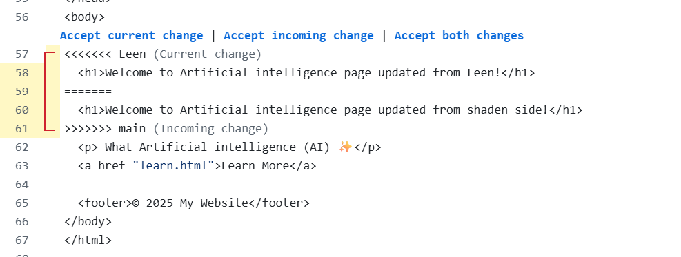
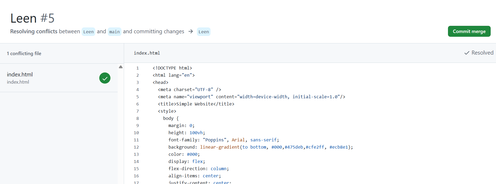
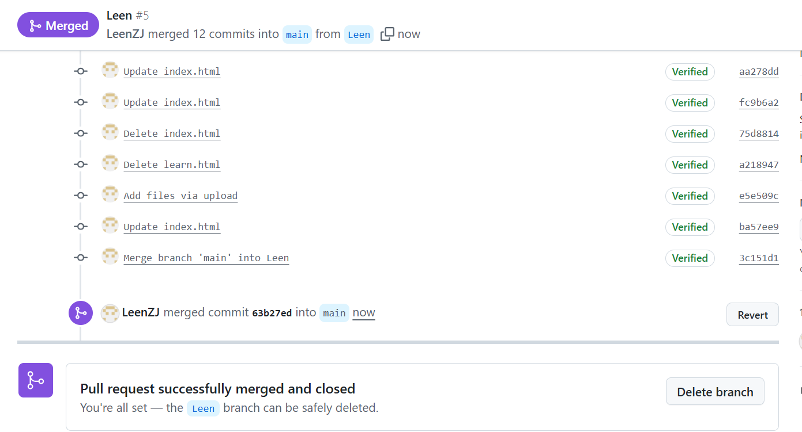

# Week7-Website

# Project overview 
This project is a simple Website built using HTML & CSS

# Steps
- visited the "Lovable AI tool" to explore examples and get an idea for my design 
- build a simple website using HTML & CSS
- Create a GitHub repository called "Week7-Website" 
- Create a GitHub project that has 2 branches
- Uploaded my website files (index & learn files) in Leen branch
- Create a pull request from Leen branch to main
- prepared this report

  # Screenshots
  here is a screenshot showing the main steps of this task :
  - **website:**
 
    
   ,  

  
  - **codes:**
 

   ,  

  - **branches:**
    
 
    

  - **my branch:**

     

# Tools Used
- visual studio code (VS)
- Lovable
- GitHub

# Create Conflict Problem & Resolve 
- **Problem**
a merge conflict happened when both branches (Leen & Shaden) modifaied the same line of code in the same file
GitHub showed a conflict message that must resolve .

- **Resolve**
I resolve the conflict by choosing the current version of the code and committing the changes.
After resolve the conflict the merge to the main was successful.

- **Screenshots**

-first merge was successful:

  

  -second merge shows conflit problem:

   

   -a resolve must apply:

  

  -resolve was successful:

  

  -second merge was successful:

  
  

  

   

   
  

   
    

  

 

  
